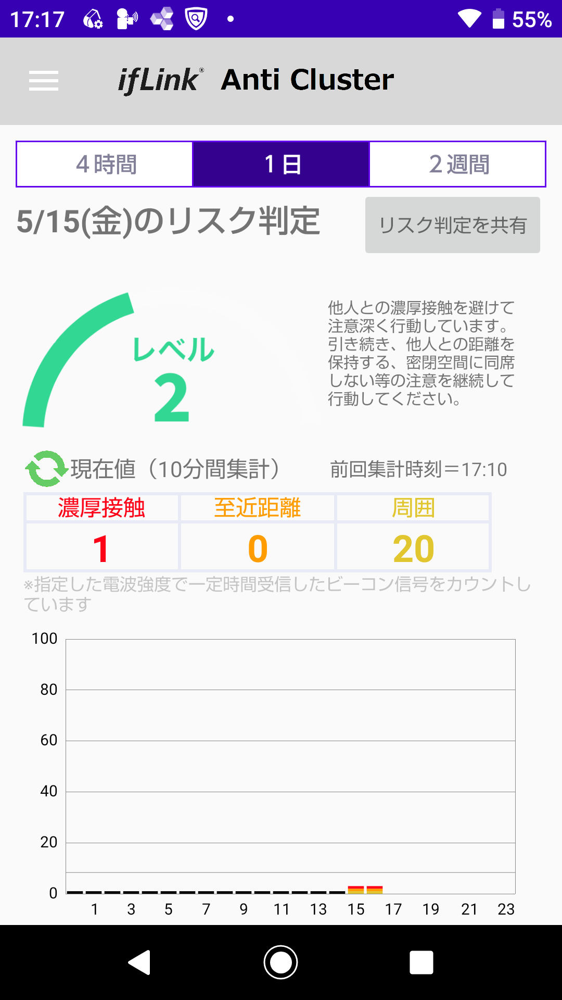
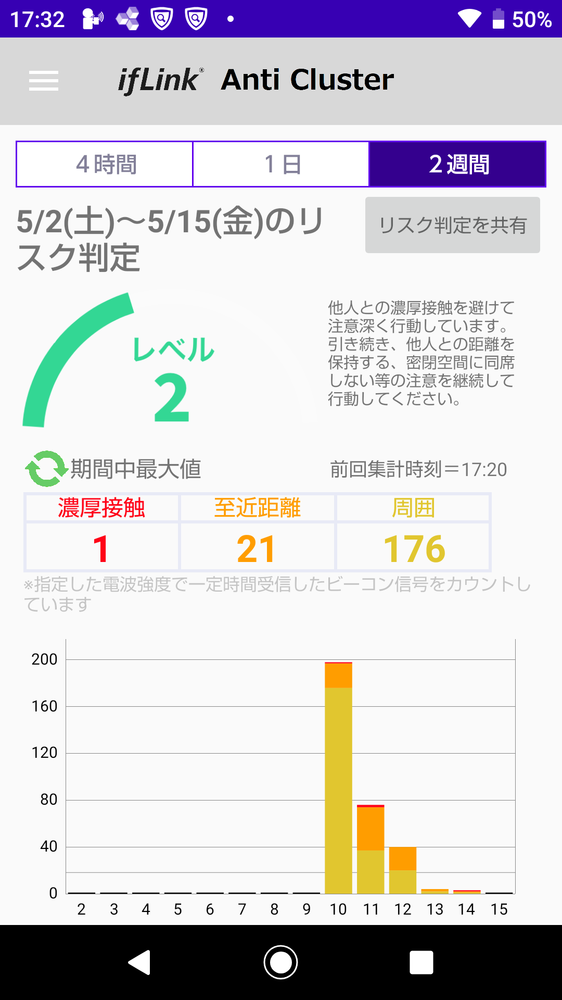
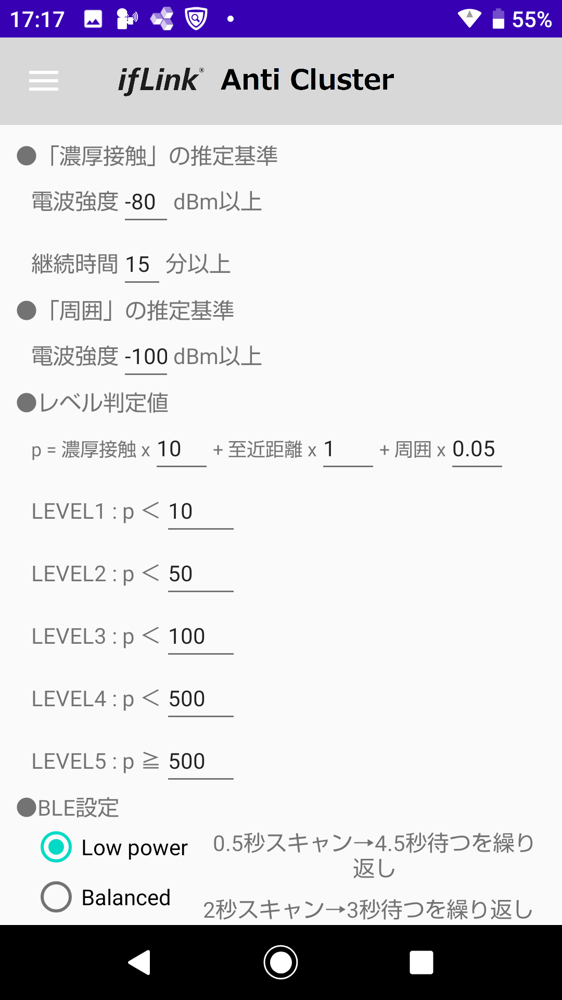

## About ifLink AntiCluster Personal

[English text follows the Japanese text.](#overview-1)

## Overview
スマートフォンが発信するビーコン信号を利用して近接した数を計測するアプリです。

## Description
スマートフォンがBluetooth機器接続のために発信しているAdvertisingパケットを受信し、<br>
電波強度と継続時間に応じて「濃厚接触」「至近距離」「周囲」の判定を行い、近接している人の数としてカウントします。<br>
一定距離で一定時間以上、近接している人がいた場合、濃厚接触としてカウントします。<br>
カウントの現在値は10分毎に集計・クリアされる値で、この値がリアルタイムにグラフに描画されます。<br>
表示期間中のカウントの最大値を元に、リスク判定結果が表示されます。<br>
"リスク判定を共有"する機能もあり、手動でリスク判定のレベル値をAdvertisingパケットにて共有可能です。<br>
（自動で共有する機能はありません）

## Screenshots
  

## Requirement
- Android Studio 3.6.2
- Android SDK 29
- Android Build Tools v29.0.3

## Build
Gradleビルドシステムを使用しています。
1. Android Studioを起動し、"Open an existing Android Studio project"でフォルダを選択します。
2. "Make Project"でアプリをビルドします。
3. "Run'app'"でアプリを実行します。

## Usage
BluetoothをONにして使用してください。<br>
アプリを起動している間、Bluetooth機器のAdvertisingパケットをスキャンし、カウントします。<br>
アプリを終了すると、カウントも停止します。<br>
"リスク判定を共有"ボタンを押下すると、規定のフォーマットでAdvertisingパケットを送信します。<br>
AdvertisingパケットのUUIDは、設定画面で変更可能です。<br>

Advertisingパケットをスキャンするタイミングおよび電波強度の値は、Android端末に依存します。<br>
初期設定ではLow power（約5秒に1回、0.5秒間スキャン）設定ですが、設定画面で変更も可能です。<br>
（一般的に、スキャン頻度を上げるとバッテリー性能は低下します）<br>

電波強度および継続時間に応じた近接判定の閾値も、設定画面で変更可能です。<br>
濃厚接触の判定は、初期設定では-65dBm以上で15分以上です。<br>
検出されたデバイスが濃厚接触の電波強度以上で継続時間に達するまでは、至近距離と判定されます。<br>
検出されたデバイスが濃厚接触の電波強度未満の場合、初期設定では-75dBm超過までは「周囲」と判定されます。<br>
検出されたデバイスが「周囲」の判定基準以下の場合は、カウント対象外となります。

## Risk level calculation
リスク判定の計算は、４時間／１日／２週間のそれぞれの期間で、期間中のカウントの最大値を元に行われます。<br>
（現在値の左のアイコンをタップすることで、期間中最大値をの表示に切り替わります）<br>
リスク判定の基準となる判定値を求める計算式は、以下となります。
```
判定値p = (濃厚接触の数 * 係数1) + (至近距離の数 * 係数2) + (周囲の数 * 係数3)
```
上記の判定値pを元に、レベル1～5の閾値に応じてレベルを判定します。
```
Level 1 : p < 閾値1
Level 2 : p < 閾値2
Level 3 : p < 閾値3
Level 4 : p < 閾値4
Level 5 : p >= 閾値4
```
レベルの閾値および計算式の係数は、設定画面で変更することができます。

カウントした値はデータファイルとして外部から参照可能なディレクトリに保存しています。

## Risk level BLE format
リスク判定のレベル値を送信する際のAdvertisingパケットのペイロードは以下の通りです。

ケース1: UUIDの先頭が1~2byte<br>
例: UUID=0000<ins>b81d</ins>-0000-1000-8000-00805f9b34fb, リスクレベル値=2<br>
> 0x0303<ins>1db8</ins>0516<ins>1db8</ins>0002

ケース2: UUIDの先頭が3~4byte<br>
例: UUID=<ins>1000b81d</ins>-0000-1000-8000-00805f9b34fb, リスクレベル値=3<br>
> 0x0505<ins>1db80100</ins>0720<ins>1db80100</ins>0003

ケース1のフォーマット：<br>
> 0x0303<ins>XXXX</ins>0516<ins>XXXX</ins>nnnn

ケース2のフォーマット：<br>
> 0x0505<ins>XXXXXXXX</ins>0720<ins>XXXXXXXX</ins>nnnn

ケース1の詳細：
|長さ|タイプ|値|
|:-:|:-:|:--|
|0x03|0x03|UUIDの先頭2byte|
|0x05|0x16|UUIDの先頭2byte＋リスクレベル値2byte<br>※UUIDはリトルエンディアンで格納|

ケース2の詳細：
|長さ|タイプ|値|
|:-:|:-:|:--|
|0x05|0x05|UUIDの先頭4byte|
|0x07|0x20|UUIDの先頭4byte＋リスクレベル値2byte<br>※UUIDはリトルエンディアンで格納|

なお、UUIDは以下の形式でないとエラーとなります。<br>
XXXXXXXX-0000-1000-8000-00805f9b34fb（XXXXXXXXは8桁の16進数）

このフォーマットは暫定的なものであり、今後変更される可能性があります。

## Depends
このアプリでは以下のライブラリを使用しています。
- Gson
- MPAndroid Chart

Android OS 7.0以降に対応しています。

## Sample Application
ソースコードをビルドしたサンプルアプリケーションを登録しています。<br>
[SampleApplication/anticluster_1.0.5.apk](https://github.com/ifLink-AntiCluster/AntiClusterPersonal/raw/master/SampleApplication/anticluster_1.0.5.apk)

## Community
リクエスト、質問、バグリポートがある場合、GitHubのissue機能を使用して下さい。

## License
[MIT](./LICENSE)

## Disclaimer
本リポジトリに登録しているアプリケーションはソースコードをビルドした結果のサンプルであり、ソースコードの内容と変わりません。<br>
本リポジトリに登録しているアプリケーションの詳細、使用方法については、READMEに掲載している説明文を参照下さい。<br>
なお、本アプリケーションは、以下の事項を確認し、同意いただいたうえでご利用下さい。<br>

本アプリケーションの利用をもって、本免責事項に同意いただいたものとみなします。<br>
本アプリケーションのダウンロードおよびご利用については、利用者自身の責任において行われるものとします。<br>
ifLinkOpenCommunityは、本アプリケーションを使用することによって生じた、いかなる損害（有形無形に関わりなく）に対して責任を負いません。<br>
ご自身の責任においてご利用いただきますようお願いいたします。<br>
ifLinkOpenCommunityは、利用者に対し、本アプリケーションにおいて提供するすべての情報について、その正確性、有用性、最新性、適切性等、その内容について何ら法的保証をするものではありません。

## Link
[ifLink](https://iflink.jp/)


## Overview
This is an application that measures the number of proximity using beacon signals transmitted by smartphones.

## Description
It receives the advertising packets that the smartphone is transmitted to connect to the Bluetooth device and counts as the number of people who are in close proximity by judging "close contact", "near" and "around" according to the RSSI and duration.<br>
If there is a person who is in close proximity for more than a certain amount of time at a certain distance, it is counted as "close contact".<br>
The "Current" is a value that is counted and cleared every 10 minutes, and it is drawn on the graph in real time.<br>
The results of the risk level are displayed based on the maximum value of the count during a display period.<br>
There is also a function to share risk level which allows you to manually share the risk level value by the advertising packet.<br>
Note that the the risk level never shared automatically.

## Screenshots
  

## Requirement
- Android Studio 3.6.2
- Android SDK 29
- Android Build Tools v29.0.3

## Build
The Gradle build system is used.
1. Launch Android Studio and select a folder under "Open an existing Android Studio project".
2. Build your app with "Make Project".
3. "Run 'app'" to run the app.

## Usage
Please turn on Bluetooth to use it.<br>
While the app is running, it scans and counts the advertising packets of Bluetooth devices.<br>
When you close the app, counts process will be stop.<br>
When you click the "Share the Level" button, the advertising packet will be transmitted in the specified format.<br>
You can change the UUID of advertising packets by the settings screen.<br>

The timing of scanning for advertising packets and the RSSI value depends on the Android device.<br>
The default value is a low power (scan once about every 5 seconds for 0.5 seconds), but this can be changed by the settings screen.<br>
(In general, the increased frequency of scans leads to a decrease in battery performance.)<br>

Thresholds for proximity determination based on RSSI value and scanning duration can change by the setting screen.<br>
The "close contact" is judged when a device RSSI value is -65dBm (by default) or more and continues for 15 minutes (by default) or more.<br>
A detected device is judged as "near" when its RSSI value is the RSSI of "close contact" or more and until the duration time of "close contact" is reached.<br>
If a detected device's RSSI value is less than the RSSI of "close contact", it will be judged as "around" until it exceeds -75dBm (by default).<br>
If a detected device's RSSI value is less than the RSSI of "around", it will not be counted. 

## Risk level calculation
The calculation of the risk level is based on the maximum value of the count during the period for each of the four-hours, one-day and two-weeks periods.
(switch to the display of the maximum value by tapping the icon to the left of the current value)
The formula for calculating the value to be used as the basis for risk level is as follows.
```
Judgment value p = (number of "close contact" * factor 1) + (number of "near" * factor 2) + (number of "around" * factor 3)
```
Based on the above judgment value p, the level is judged according to the threshold of level 1 to 5.
```
Level 1 : p < threshold 1
Level 2 : p < threshold 2
Level 3 : p < threshold 3
Level 4 : p < threshold 4
Level 5 : p >= threshold 4
```
The level thresholds and formula factors can be changed by the setting screen.

The counted value is saved as a data file in a directory that can be accessed from outside.

## Risk level BLE format
The payload of BLE advertising when send risk level value is as follows.

Case 1: UUID of the first section is 1 to 2 bytes<br>
Example: UUID=0000<ins>b81d</ins>-0000-1000-8000-00805f9b34fb, RiskLevel=2<br>
> 0x0303<ins>1db8</ins>0516<ins>1db8</ins>0002

Case 2: UUID of the first section is 3 to 4 bytes<br>
Example: UUID=<ins>1000b81d</ins>-0000-1000-8000-00805f9b34fb, RiskLevel=3<br>
> 0x0505<ins>1db80100</ins>0720<ins>1db80100</ins>0003

Format of case 1:<br>
> 0x0303<ins>XXXX</ins>0516<ins>XXXX</ins>nnnn

Format of case 2:<br>
> 0x0505<ins>XXXXXXXX</ins>0720<ins>XXXXXXXX</ins>nnnn

Details of case 1:
|LEN.|TYPE|VALUE|
|:-:|:-:|:--|
|0x03|0x03|UUID of the first 2 bytes|
|0x05|0x16|UUID of the first 2 bytes + Risk level value (2 bytes)<br>Note: UUID is little endian byte order.|

Details of case 2:
|LEN.|TYPE|VALUE|
|:-:|:-:|:--|
|0x05|0x05|UUID of the first 4 bytes|
|0x07|0x20|UUID of the first 4 bytes + Risk level value (2 bytes)<br>Note: UUID is little endian byte order.|

Note that UUID must be in the following format or causes error.<br>
XXXXXXXX-0000-1000-8000-00805f9b34fb（XXXXXXXX is 8 digits hexadecimal number）

This format is provisional and subject to change.

## Depends
The following libraries are used in this app.
- Gson
- MPAndroid Chart

Compatible with Android OS 7.0 or later.

## Sample Application
Here is a sample applicaiotn apk which built from the source code.<br>
[SampleApplication/anticluster_1.0.5.apk](https://github.com/ifLink-AntiCluster/AntiClusterPersonal/raw/master/SampleApplication/anticluster_1.0.5.apk)

## Community
If you have a request, question, or bug report, please use the issue feature on GitHub.

## License
[MIT](./LICENSE)

## Disclaimer
The application registered in this repository is a sample of the result of building the source code, and it is not different from the content of the source code.<br>
For details of the applications registered in this repository and how to use them, please refer to the instructions in the README.<br>
Please use this application after confirming and agreeing to the following terms and conditions.<br>

By using this application, you agree to be bound by this disclaimer.<br>
Users are responsible for downloading and using this application.<br>
ifLink Open Community shall not be liable for any damage (whether tangible or intangible) caused by the use of this application.<br>
Please use the site at your own risk.<br>
ifLink Open Community makes no legal guarantee to the User of the accuracy, usefulness, timeliness or appropriateness of any information provided in the Application.

## Link
[ifLink](https://iflink.jp/)

